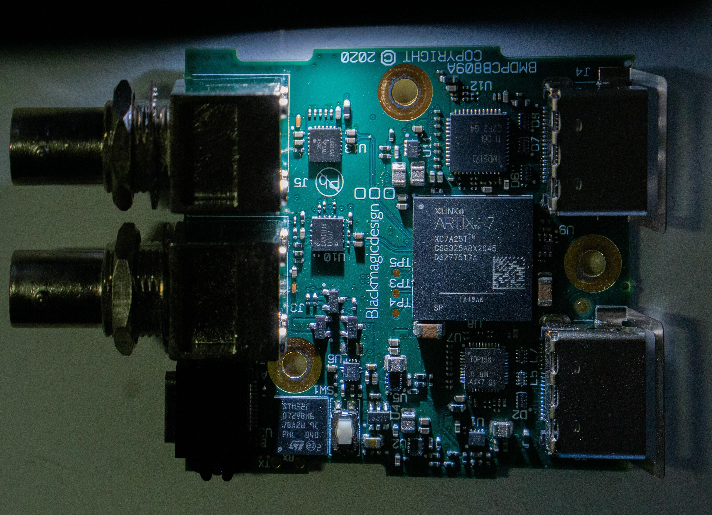
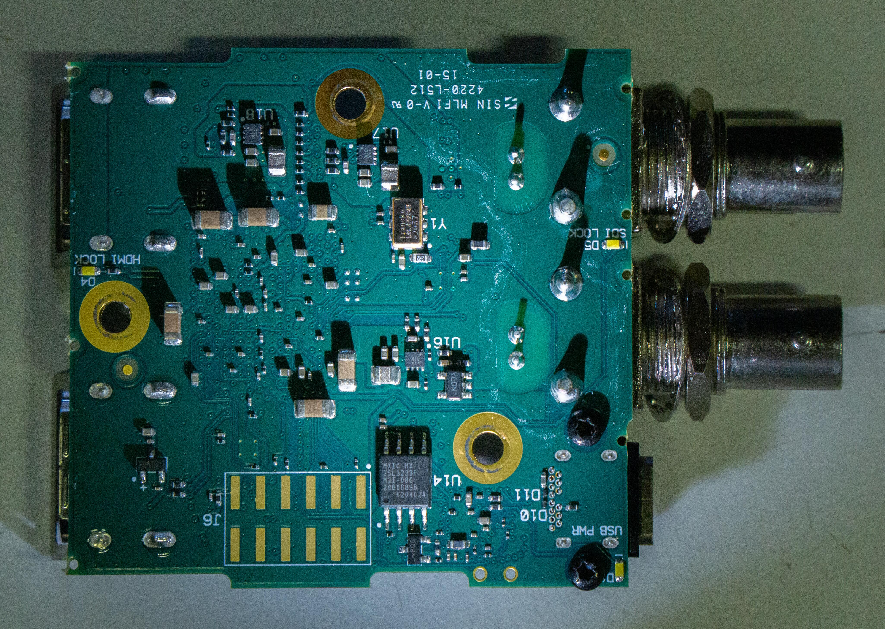
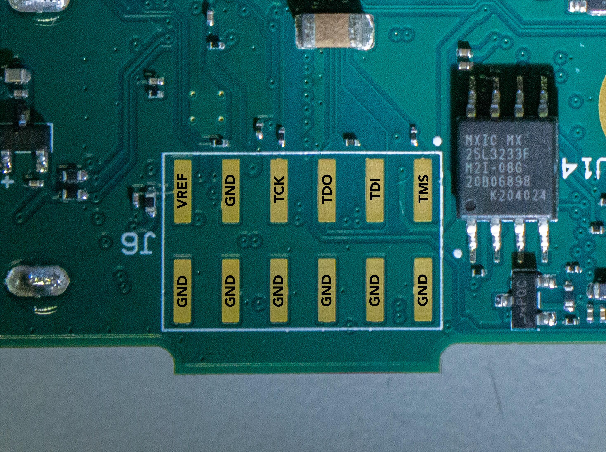

This repository contains reverse engineered pinouts, constraint files and example vivado projects to use the Blackmagic Design Micro Converter Bidirectional 3G as a general purpose FPGA development board with SDI / HDMI connectivity.

## PCB Photos

     
    <i>Top side of the PCB</i>
       

     
    <i>Bottom side of the PCB</i>
       

## FPGA

The converter uses a Xilinx Artix 7 XC7A25T in the CSG325 package.

### JTAG

The FPGA can be reconfigured using Vivado via the JTAG interface. Fortunately, this is exposed on pads on the bottom of the pcb:

     
    <i>JTAG Pinout</i>
       

### Flash

### IO Banks

| Bank | Voltage |
| ---- | ------- |
| 14   | 3.3V    |
| 15   | 1.8V    |
| 34   | 1.2V    |

### Clock

The Board has a single LVDS 148.425824MHz clock, connected to the MGTREFCLK1 Pins. This can be used as a reference clock for the GTP Transceivers, but also for the FPGA Logic.

## LEDs

The two LEDs SDI_LOCK and HDMI_LOCK are connected to the FPGA and switched at their low side, so driving the FPGA pins low turns on the LED, driving it HIGH turns it off.

| LED       | FPGA Package Pin | FPGA Bank | FPGA Pin Name         |
| --------- | ---------------- | --------- | --------------------- |
| SDI_LOCK  | U9               | 14        | IO_L10P_T1_D14_14     |
| HDMI_LOCK | N18              | 14        | IO_L24P_T3_A01_D17_14 |

## SDI Driver (Output)

The SDI Driver, a Texas Instruments LMH0307, is connected to the following pins of the FPGA:

| LMH0307 Pin | FPGA Package Pin | FPGA Bank | FPGA Pin Name      |
| ----------- | ---------------- | --------- | ------------------ |
| RSTI        | R15              | 14        | IO_L12N_T1_MRCC_14 |
| ENABLE      | R17              | 14        | IO_L14N_T2_SRCC_14 |
| SDA         | T15              | 14        | IO_L13N_T2_MRCC_14 |
| SCL         | T14              | 14        | IO_L13P_T2_MRCC_14 |
| FAULT       | ?                | ?         | ?                  |
| SDI_P       | H2               | 216       | MGTPTXP0_216       |
| SDI_N       | H1               | 216       | MGTPTXN0_216       |

## SDI Equalizer (Input)

The SDI Equalizer, a Texas Instruments LMH0324, is connected to the following pins of the FPGA:

| LMH0324 Pin | FPGA Package Pin | FPGA Bank | FPGA Pin Name |
| ----------- | ---------------- | --------- | ------------- |
| CD_N        | ?                | ?         | ?             |
| SS_N        | ?                | ?         | ?             |
| MISO        | ?                | ?         | ?             |
| MOSI        | ?                | ?         | ?             |
| SCK         | ?                | ?         | ?             |
| SDA         | ?                | ?         | ?             |
| SCL         | ?                | ?         | ?             |
| OUT0_P      | ?                | ?         | ?             |
| OUT0_N      | ?                | ?         | ?             |

with the following configuration Pins:

| LMH0324 Pin | Connected To |
| ----------- | ------------ |
| IN_OUT_SEL  | ?            |
| OUT_CTRL    | ?            |
| VOD_DE      | ?            |
| MODE_SEL    | ?            |
| ADDR0       | ?            |
| ADDR1       | ?            |

## HDMI Retimer (Input)

The HDMI Input uses a Texas Instruments TMDS171 retimer.

| TMDS171 Pin | FPGA Package Pin | FPGA Bank | FPGA Pin Name |
| ----------- | ---------------- | --------- | ------------- |
| OUT_D0_P    | ?                | ?         | ?             |
| OUT_D0_N    | ?                | ?         | ?             |
| OUT_D1_P    | ?                | ?         | ?             |
| OUT_D1_N    | ?                | ?         | ?             |
| OUT_D2_P    | ?                | ?         | ?             |
| OUT_D2_N    | ?                | ?         | ?             |
| OUT_CLK_P   | ?                | ?         | ?             |
| OUT_CLK_N   | ?                | ?         | ?             |
| SDA_SNK     | ?                | ?         | ?             |
| SCL_SNK     | ?                | ?         | ?             |
| HPD_SNK     | ?                | ?         | ?             |
| SPDIF_IN    | ?                | ?         | ?             |
| ARC_OUT     | ?                | ?         | ?             |
| OE          | ?                | ?         | ?             |
| SIG_EN      | ?                | ?         | ?             |
| PRE_SEL     | ?                | ?         | ?             |
| SDA_CTL     | ?                | ?         | ?             |
| SCL_CTL     | ?                | ?         | ?             |
| I2C_EN/PIN  | ?                | ?         | ?             |
| EQ_SEL/A0   | ?                | ?         | ?             |
| A1          | ?                | ?         | ?             |
| TX_TERM_CTL | ?                | ?         | ?             |
| SWAP/POL    | ?                | ?         | ?             |

## HDMI Driver (Output)

The HDMI Output uses a Texas Instruments TDP158 retimer / driver.

| TDP158 Pin   | FPGA Package Pin | FPGA Bank | FPGA Pin Name |
| ------------ | ---------------- | --------- | ------------- |
| IN_D0_P      | ?                | ?         | ?             |
| IN_D0_N      | ?                | ?         | ?             |
| IN_D1_P      | ?                | ?         | ?             |
| IN_D1_N      | ?                | ?         | ?             |
| IN_D2_P      | ?                | ?         | ?             |
| IN_D2_N      | ?                | ?         | ?             |
| IN_CLK_P     | ?                | ?         | ?             |
| IN_CLK_N     | ?                | ?         | ?             |
| HPD_SRC      | ?                | ?         | ?             |
| SDA_SRC      | ?                | ?         | ?             |
| SCL_SRC      | ?                | ?         | ?             |
| OE           | ?                | ?         | ?             |
| I2C_EN       | ?                | ?         | ?             |
| SDA_CTL/PRE  | ?                | ?         | ?             |
| SCL_CTL/SWAP | ?                | ?         | ?             |
| A0/EQ1       | ?                | ?         | ?             |
| A1/EQ2       | ?                | ?         | ?             |
| SLEW         | ?                | ?         | ?             |
| TERM         | ?                | ?         | ?             |

## Microcontroller

The STM32F072VBH6 is connected to the USB-C Port and to the FPGA in a currently unknown way. There are pads labeled `rx` and `tx` next to it. It might be possible to use these to flash the stm32 via usart, but i haven't tested this yet.

# Reverse Engineering Techniques

## Pin Mapping

The Vivado Project in `vivado/bmd-bidi-pin-mapping` can be used to map out which pins of the fpga connect to pins of other chips / leds / ...

It configures all pins as inputs and connects them to an ILA core. A 10k resistor connected to gnd or the bank voltage can then be touched to a pin to pull up / down the signal. This can then be seen in the ILA Debugger.

# Example Vivado Projects

There are a few example Vivado Projects located in `/vivado/`. Every project directory includes a `README.md` with a brief description.

| Project              | Description                                                                                                           |
| -------------------- | --------------------------------------------------------------------------------------------------------------------- |
| bmd-bidi-pin-mapping | See above                                                                                                             |
| bmd-bidi-blink       | Blinks both LEDs using a simple counter at different rates                                                            |
| bmd-bidi-hd-sdi-out  | Outputs SMPTE Color Bars or a Pathological Pattern via HD-SDI (1080p30, not fully compliant, crc not implemented yet) |
|                      |                                                                                                                       |

